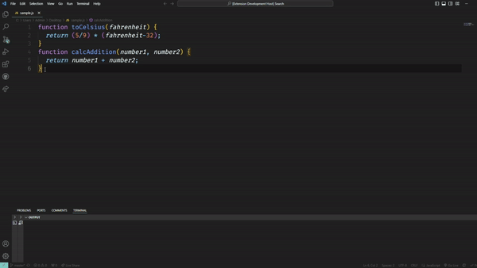

# Smart Commenting

Smart Commenting is a VS Code extension that automatically generates concise, meaningful comments for your functions in JavaScript and C++. Say goodbye to tedious documentation and hello to instant, intelligent code annotations!

## Features

- Automatically generates comments for functions in JavaScript and C++ files
- Inserts comments directly above each function, preserving original code formatting
- Works on file save, seamlessly integrating into your workflow
- Utilizes AI to create context-aware, meaningful comments.

### Demo

## Requirements

- Visual Studio Code v1.60.0 or higher
- An active internet connection (for AI-powered comment generation)

## Installation

1. Open Visual Studio Code
2. Go to the Extensions view (Ctrl+Shift+X)
3. Search for "Smart Commenting"
4. Click Install

## Usage

1. Open a JavaScript or C++ file
2. Write or modify a function
3. Save the file (Ctrl+S)
4. Watch as intelligent comments appear above your functions!

## Extension Settings

This extension contributes the following settings:

- `smartCommenting.enable`: Enable/disable the Smart Commenting extension
- `smartCommenting.commentStyle`: Choose between single-line (//) or multi-line (/\* \*/) comments

## Release Notes

### 1.0.0

---

## Donations

If you find Smart Commenting helpful and would like to support its continued development, consider making a donation. Your contributions help us maintain and improve the project!

[Donate Here ❤️](https://buymeacoffee.com/deepakkn)

Thank you for your support!

**Enjoy smarter, cleaner code with Smart Commenting!**
